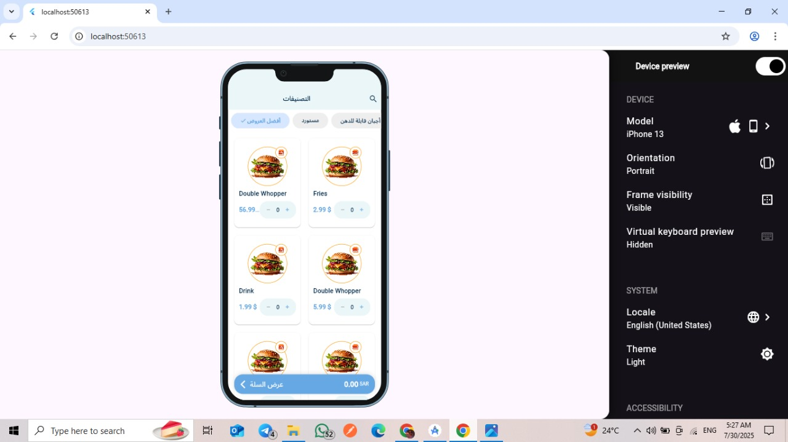

# Flutter Task

A demo Flutter app showing product categories, dynamic chips, and product grid with BLoC state management.

## 📸 Screenshot



## ✅ Features
- Display products in a grid
- Select category
- Increase/decrease quantity
- Calculate total price in the cart

## 🛠 Architecture
- Flutter + BLoC (Cubit)
- Organized into:
    - `bloc/` (business logic)
    - `models/` (data classes)
    - `data/` (repositories)
    - `ui/` (screens)
    - `core/` (shared widgets & utils)

## 🤖 ProxyAI Prompts Used
| Prompt | Applied to |
|--|--|
| "Help me organize the code and make it clean" | Code organization |
| "Help me refine and clean the UI features" | UI polishing and improvements |

## 🚀 How to run the project
1. Clone the repository:
```bash
git clone https://github.com/amira-ezzat/Flutter_Task.git
cd Flutter_Task
